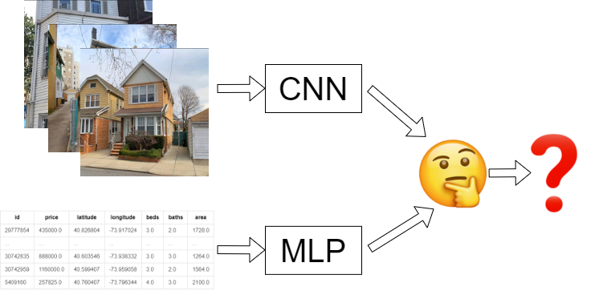

# Creating a map and KDE plot of points and polygons with Python

One of the most significant advantages of artificial deep neural networks has always been that they can pretty much take any kind of data as input and can approximate a non-linear function to predict on that data. I have been searching for online tutorials to create a neural network that takes tabular and image data as inputs and predicts a single value as output. So far, I have not found any start to end tutorials that implement such a network in PyTorch. Therefore I decided to tackle this question on my own. So in this tutorial, I will show you how you can use `PyTorch Lightning` to predict real estate prices of houses through matching image data and tabular information. [You can find the sample data sets used here](<[here](https://1drv.ms/u/s!AqUPqx8G81xZiL1l80RtZbjPj43MhA?e=KagzKc)>). The full tutorial is available through my [blog](https://rosenfelder.ai/multi-input-neural-networ-pytorch/).
